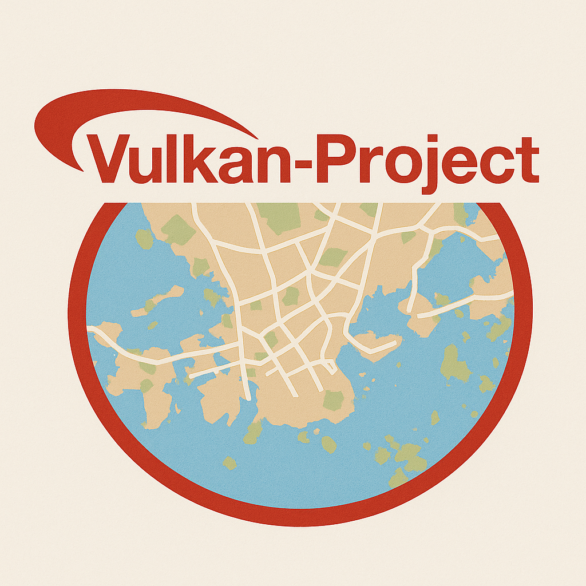

# 

A lightweight graphics engine built on top of Vulkan. The project is primarily intended for graphics engine prototyping and for designing a higher-level abstraction layer over the Vulkan API.

## Hardware Requirements
- Vulkan API 1.3 version is required.
- Dynamic rendering device feature is required.

## Build Requirements
- Vulkan SDK 1.3 version is required.
- Before building, ensure the `VCPKG_ROOT` environment variable is defined.

### Ubuntu 20.04
Install the following dependencies:
- cmake
- pkg-config
- vcpkg
- vulkan-sdk
- vulkan-tools
- libvulkan-dev
- glslc

## Build
Follow the instructions:
- Build shaders by running `shaders/compile.sh` script.
- Build the engine:
```
cmake --preset=vcpkg
cmake --build build
```

## Examples
- `simple_demo`: Textured plane in 3D space.
- `map_demo`: OpenStreetMap map tile rendering.
